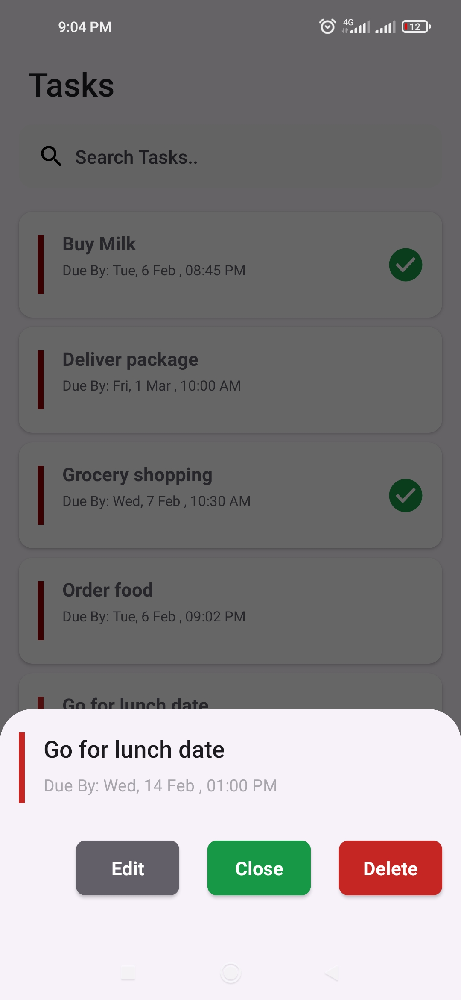

Task Management Application

----------------------------------

- Mobile application to help users manage daily todo tasks.

## Requirements

Ensure you have your environment set up. Use this checklist to verify.

* JDK Version 1.7 & above
* [Android SDK.](http://developer.android.com/sdk/index.html)
* Android SDK Tools
* Android SDK Build tools 33.0.0
* Android Support Repository
* Android Support library

Contribution guidelines.
--------------------------------

[Project Contribution guidelines](Project Guidelines.md)

### How it's built

* Technologies used
    * [Kotlin](https://kotlinlang.org/)
    * [XML Layout](https://developer.android.com/develop/ui/views/layout/declaring-layout)
    * [ROOM ORM](https://developer.android.com/training/data-storage/room)
    * [Material 3](https://developer.android.com/jetpack/compose/designsystems/material3)
    * [Coroutines](https://kotlinlang.org/docs/reference/coroutines-overview.html)
    * [Flow](https://kotlinlang.org/docs/reference/coroutines/flow.html)
    * [KOIN Dependency](https://insert-koin.io/)
    * [Retrofit](https://square.github.io/retrofit/)
        * [Jetpack](https://developer.android.com/jetpack)
            * [Lifecycle](https://developer.android.com/topic/libraries/architecture/lifecycle)
            * [ViewModel](https://developer.android.com/topic/libraries/architecture/viewmodel)
* [Timber](https://github.com/JakeWharton/timber)

* Architecture
    * MVVM - Model View ViewModel

* Tests
    * [JUnit5](https://junit.org/junit5/)
    * [MockK](https://github.com/mockk/mockk)

* Gradle
    * [Gradle Kotlin DSL](https://docs.gradle.org/current/userguide/kotlin_dsl.html)
    *
* Plugins
  * [jacoco](https://github.com/jacoco/jacoco)

### Todo app screenshots

| 
||  
||   ||
